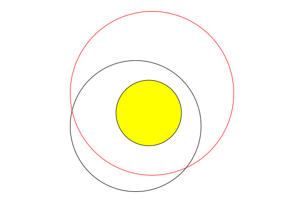
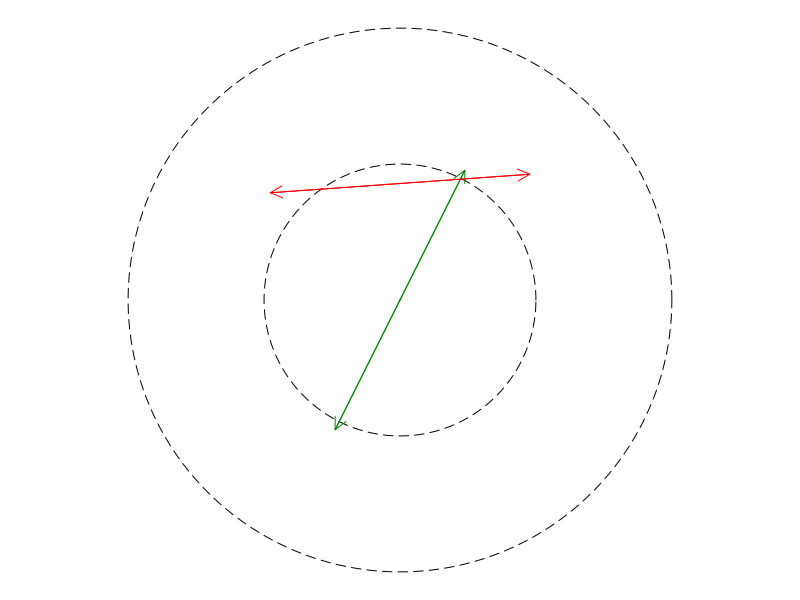
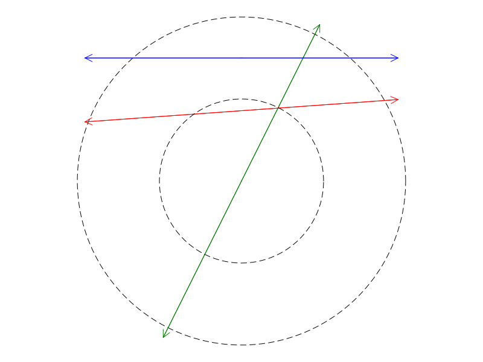
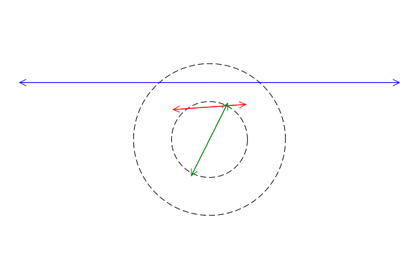
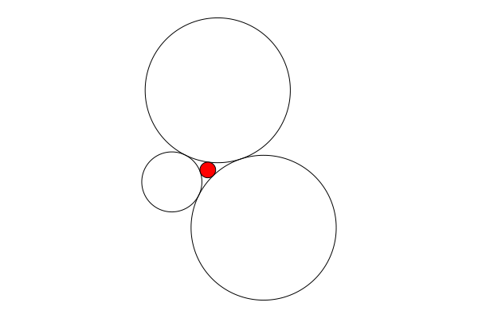

# Clines

A [cline](https://en.wikipedia.org/wiki/Generalised_circle) is a circle or a line in the plane. 

## Construction

A cline is specified by three points in the plane represented by complex numbers. If the three points are collinear, then a line is created. Otherwise, there is a unique circle containing those three points and that is what is returned.
```
julia> using Clines

julia> Cline(2-im, 3im, 1-im)
Circle(1.5, 1.25, 2.3048861143232218)

julia> L = Cline(0, 1+im, -1-im)
Line(1.0 + 1.0im, -1.0 - 1.0im)
```

**Notes**

+ If two of the arguments to `Cline` are equal, then a `Line` is created through the two distince points. 

+ If one of the arguments to `Cline` is infinite, a `Line` is created through the two (finite) points. 

+ Note that the `Clines` module defines two data types: `Circle` and `Line`, and these are subtypes of the abstract type `Cline`.

+ A `Circle` can be directly constructed by specifying a center `z` and a radius `r` like this: `Circle(z,r)`.

+ A `Line` can be directly constructed by specifying two points `w` and `z` like this: `Line(w,z)`. 

## Inspection

For any cline `C`, the function `three_points(C)` returns a list of three complex numbers that are distinct points on `C`. 
+ In the case of a circle, the three points are equally spaced around the circle at 0, 120, and 240 degrees starting from the far right. 
+ For a line, the three points are the two points used to define the line and their midpoint. 

For a circle `C`, we have the following:
+ `center(C)` returns the center of the circle as a complex number.
+ `radius(C)` returns the radius of the circle. 
+ `area(C)` returns the area of the circle.
+ `circumference(C)` returns the circumference.

For a line `L`, we have the following:
+ `slope(L)` returns the slope of the line (possibly `Inf`).
+ `dilate(L,factor=2)` creates a new `Line` object that is equal to `L` but whose defining points are further apart by a factor of `factor`.  


## Pairs

### Intersection

Given two clines `C` and `D` use `intersect(C,D)` or `C ∩ D` to return a set of points that are common to the two clines. This set may have zero, one, or two elements. 
```
julia> C = Circle(0im, 1)
Circle(0.0, 0.0, 1.0)

julia> D = Circle(0.5im,1)
Circle(0.0, 0.5, 1.0)

julia> C ∩ D
Set{ComplexF64} with 2 elements:
  -0.9682458365518543 + 0.25im
  0.9682458365518543 + 0.25im
```

> **Note**: If the two clines are equal, a warning is issued and the empty set is returned. 

### Angle

For two clines, `angle(C,D)` computes the angle of intersection in the range `[0,π/2]`. If the clines do not intersect, an error is thrown. Note that parallel lines are considered to intersect at infinity and their angle is reported as `0`.


### Containment

For a point `z` and a cline `C`, use `in(z,C)` or `z ∈ C` to test of if `z` lies on `C`.
```
julia> C = Circle(0im,1)
Circle(0.0, 0.0, 1.0)

julia> z = 0.6 + 0.8im
0.6 + 0.8im

julia> z ∈ C
true
```

For two circles `C` and `D`, use `issubset(C,D)` or `C ⊆ D` to test if the circle `C` is contained inside circle `D`. 


## Linear Fractional (Möbius) Transformations

Clines can be used to define and to be transformed by [Linear Fractional Transformations](https://github.com/scheinerman/LinearFractionalTransformations.jl).

If `F` is a linear fractional transformation, then `F(C)` is the result of applying `F` to the cline `C`.

Given a cline `C`, calling `LFT(C)` returns a linear fractional transformation that maps `C` to the x-axis.

Given two clines `C` and `D`, calling `LFT(C,D)` returns a linear fractional transformation that maps `C` to `D`.


## Inversion

To find the [inversion](https://en.wikipedia.org/wiki/Inversive_geometry) of a point or a cline through another cline, use `inv`:
+ `inv(C,z)` finds the image of the point `z` by inversion through `C`.
+ `inv(C,D)` finds the image of cline `D` by inversion through `C`.

Calling `inv(C)` returns a function `F` with the property that `F(x)` gives `inv(C,x)`.

## Visualization

The function `draw` will draw a `Cline` on the screen using
[SimpleDrawing](https://github.com/scheinerman/SimpleDrawing.jl) in conjunction with 
[Plots](https://github.com/JuliaPlots/Plots.jl).


### Drawing circles
```
julia> using SimpleDrawing, Plots

julia> C = Circle(0,0,1)
Circle(0.0, 0.0, 1.0)

julia> D = Circle(0.25,.5,1.25)
Circle(0.25, 0.5, 1.25)

julia> E = Circle(.2,.2,.5)
Circle(0.2, 0.2, 0.5)

julia> newdraw(); draw(C); draw(D,linecolor=:red); draw(E,fill=true,color=:yellow)
```
Here is the result:



### Drawing lines

Since lines are infinite, drawing them presents a challenge. For a line `L`, calling `draw(L)`
will draw `L` in the current graphics window as a line segment with arrows on each end.
However, if the line does not overlap the current window, nothing is drawn. 

This is illustrated in the following two examples. 

In this first example, we draw a circle of radius 1 and then three lines. One of the lines (slated to be blue) lies outside the frame so it is not drawn. We then add a circle of radius 2.
```
newdraw()
draw(Circle(0, 0, 1), color = :black, style = :dash)
draw(Line(0, 0, 1, 2), color = :green)
draw(Line(-5, 0.5, 2, 1), color = :red)
draw(Line(-5, 1.5, 5, 1.5), color = :blue)
draw(Circle(0, 0, 2), color = :black, style = :dash)
```
Here is the result:



However, in this second example, we draw the big circle first (causing the plotting area to be larger)
and then draw the lines and the smaller circle. 
The window is large enough for the blue line appears.
```
newdraw()
draw(Circle(0, 0, 2), color = :black, style = :dash)
draw(Line(0, 0, 1, 2), color = :green)
draw(Line(-5, 0.5, 2, 1), color = :red)
draw(Line(-5, 1.5, 5, 1.5), color = :blue)
draw(Circle(0, 0, 1), color = :black, style = :dash)
```

As shown in the figure, the blue line is now present.




#### Forced line drawing

Because lines outside the frame of the window do not appear, we provide the function `force_draw`.
This draws the line as a double-arrowed segment joining the two points that define the line. 


```
newdraw()
draw(Circle(0, 0, 1), color = :black, style = :dash)
draw(Line(-5, 0.5, 2, 1), color = :red)
draw(Line(0, 0, 1, 2), color = :green)
force_draw(Line(-5, 1.5, 5, 1.5), color = :blue)
draw(Circle(0, 0, 2), color = :black, style = :dash)
```

Here is the result:




## Roundoff Problems

Most of the operations in this module subject to roundoff errors. For example, to test if a point `z` lies on a circle `C` we would compute the distance from `z` to the center of `C` and check if that equals the radius. However, because of roundoff errors, a strict test for equality may yield `false` when mathematically the result should be `true`.

We provide the following funtions for dealing with roundoff errors:
+ `set_tolerance(tol)` sets the tolerance for roundoff errors to `tol`. Without an argument, we set the tolerance to the module's default value.
+ `get_tolerance()` returns the current tolerance setting.

For example:
```
julia> C = Circle(0,0,sqrt(2));   # circle of radius sqrt(2)

julia> z = sqrt(2) * exp(im);     # mathematically, this is a point on C

julia> z ∈ C                      # success
true

julia> set_tolerance(1e-100)      # make tolerance unreasonably small
1.0e-100

julia> z ∈ C                      # test fails
false
```


## Kissing Circles

Given three (noncollinear) points `a`, `b`, and `c`, the function `kiss(a,b,c)` returns a list of three circles whose centers are `a`, `b`, and `c` that are pairwise tangent.

Then, given three mutually tangent circles, the function `soddy` returns a circle that is tangent to all three and nestled in the space between them.
```
julia> CC = kiss(-1,2im,1-im)
3-element Vector{Circle}:
 Circle(-1.0, 0.0, 0.6549291474156)
 Circle(0.0, 2.0, 1.5811388300841898)
 Circle(1.0, -1.0, 1.5811388300841898)

julia> S = soddy(CC...)
Circle(-0.21638837510877562, 0.26120387496374137, 0.17107003113165417)

julia> newdraw(); draw.(CC); draw(S,fill=true,color=:red); finish()
```
Here is the result:




## Other

+ `collinear(a,b,c)` determines if the points specified by the three complex numbers are collinear. 


## Rays

TBW: A `Ray` is constructed by specifying a vertex and a point on the ray. More to come.